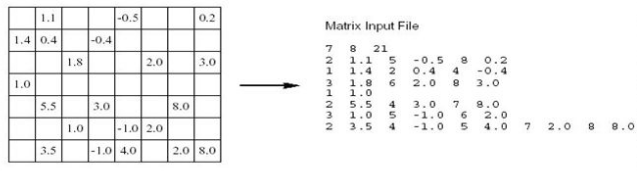

## Python scripts

* near_neighbor_similarity.py takes an input matrix from a file in Cluto's sparse-matrix format, a threshold value for the near neighbor computation and an output file path to dump the generated adjacency matrix.
    _Example_

    `./near_neighbor_similarity.py -k 10 -i 20ng.csv -o 20ng_10nnbrs.csv`
    
    
